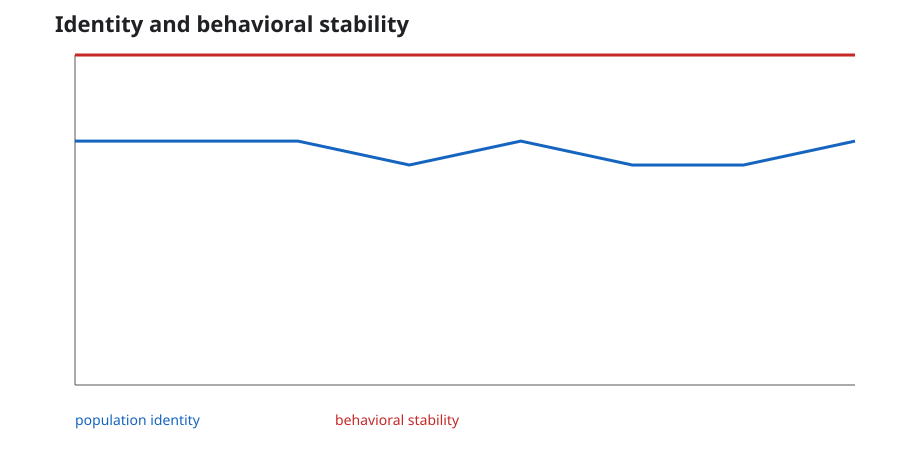
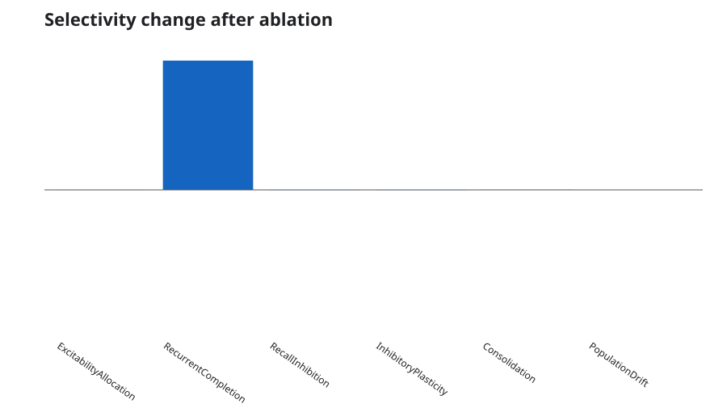
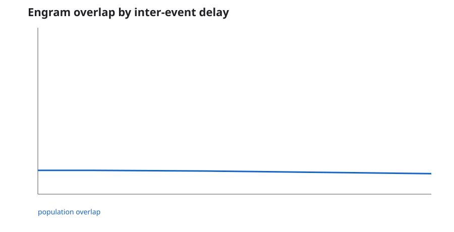
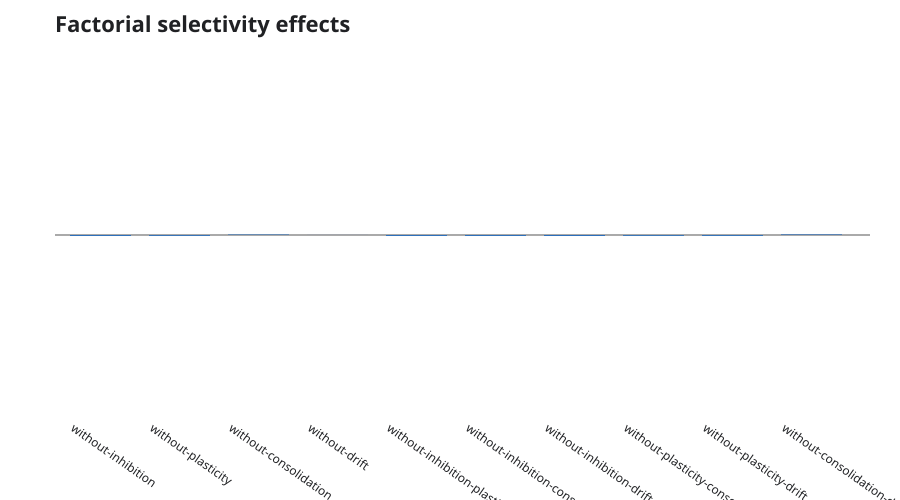
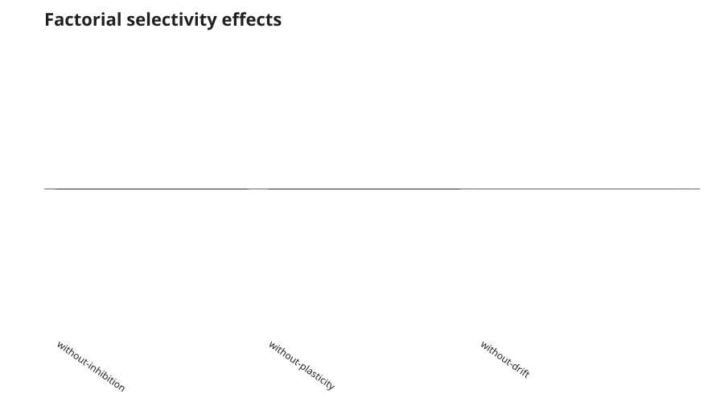
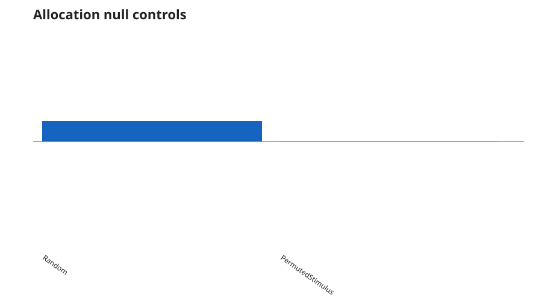
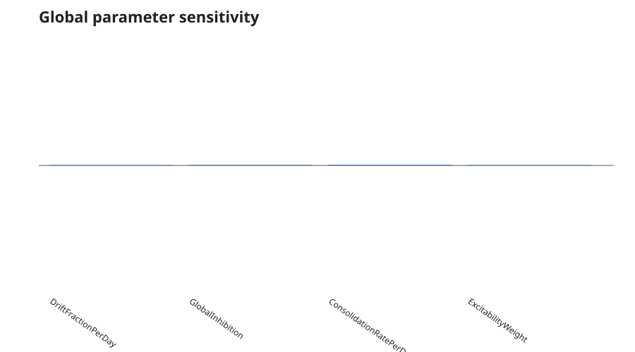

# Reproducible experiment gallery

This gallery is generated from the committed JSON plans in
`examples/DynamicEngramSimulator.Experiments/plans`. Every chart has matching JSON and CSV data. The plans fix their seed
sets and creation timestamp so a clean checkout produces byte-comparable research inputs and auditable outputs.

Regenerate the complete gallery with:

```powershell
dotnet run --project examples/DynamicEngramSimulator.Experiments -c Release -- `
  examples/DynamicEngramSimulator.Experiments/plans docs/gallery
```

## Population identity and behavior



The stability plan separates population identity from behavioral stability after simulated time and drift. The two
measures are intentionally reported independently: across eight fixed seeds, mean population identity is about 0.712
while mean behavioral stability remains about 0.99998. Stable recall does not prove stable neuronal membership.

Artifacts: [JSON](identity-vs-behavior.json) · [CSV](identity-vs-behavior.csv) ·
[SVG](identity-vs-behavior.svg)

## Paired mechanism ablations



Each condition disables one mechanism while preserving the baseline seeds and stimuli. The report contains raw paired
outcomes, bootstrap intervals, recall-survival change, and standardized selectivity effects. Read the metrics together:
an ablation may increase one margin while causing recall failure or changing population identity.

Artifacts: [JSON](mechanism-ablations.json) · [CSV](mechanism-ablations.csv) ·
[SVG](mechanism-ablations.svg)

## Temporal linking by inter-event delay



With the plan's explicit encoding boost and one-per-day excitability relaxation rate, mean population overlap is about
0.143 at 0–24 hours, 0.139 at 72 hours, and 0.123 at 168 hours across eight fixed seeds. The JSON includes deterministic
95% bootstrap intervals and recall outcomes. This is evidence about the configured simulation, not a biological estimate
of a memory-linking window.

Artifacts: [JSON](overlap-by-delay.json) · [CSV](overlap-by-delay.csv) · [SVG](overlap-by-delay.svg)

## Factorial mechanism interactions



The factorial plan evaluates four mechanisms alone and in every two-factor combination using eight paired seeds. The
report includes raw runs, bootstrap intervals, exact sign-flip p-values, standardized effects, and false-discovery-rate
adjustment. These values describe this fixed model plan; statistical significance is not biological validation.

Artifacts: [JSON](factorial-interactions.json) · [CSV](factorial-interactions.csv) ·
[SVG](factorial-interactions.svg)

## Dynamic-selectivity prediction check



This plan turns three qualitative predictions from the dynamic-selectivity research basis into executable conditions:
recall inhibition supports expression of selectivity, inhibitory plasticity supports its development, and membership
turnover can coexist with stable behavior. It is a model reproduction of qualitative predictions, not a reproduction of
the paper's biological measurements.

Artifacts: [JSON](dynamic-selectivity-predictions.json) · [CSV](dynamic-selectivity-predictions.csv) ·
[SVG](dynamic-selectivity-predictions.svg)

## Allocation null controls



The two nulls preserve seeds, population size, stimulus sparsity, cue fraction, time, and turnover. Random allocation
removes the stimulus/excitability relationship; permuted allocation rotates stimulus channels. Paired selectivity and
behavioral effects are reported separately.

Artifacts: [JSON](allocation-null-controls.json) · [CSV](allocation-null-controls.csv) ·
[SVG](allocation-null-controls.svg)

## Morris sensitivity screening



The screening plan varies turnover, global inhibition, consolidation rate, and excitability weight across explicit
uniform ranges. JSON retains all normalized samples and outputs; CSV summarizes mean absolute elementary effects and
their dispersion. The design is intended to identify inputs worth a larger Sobol run.

Artifacts: [JSON](morris-sensitivity.json) · [CSV](morris-sensitivity.csv) ·
[SVG](morris-sensitivity.svg)

## Interpretation boundary

These artifacts demonstrate reproducibility, ablation discipline, and report design. They are not neuroscience data,
clinical predictions, or evidence that the model's time constants correspond to a specific organism or brain region.
